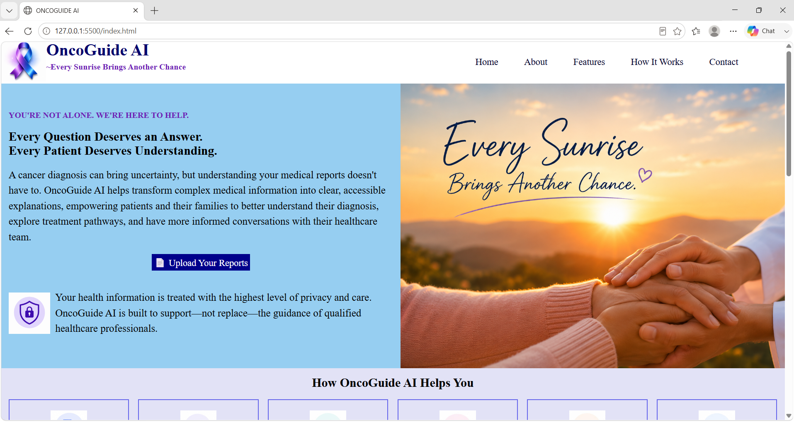
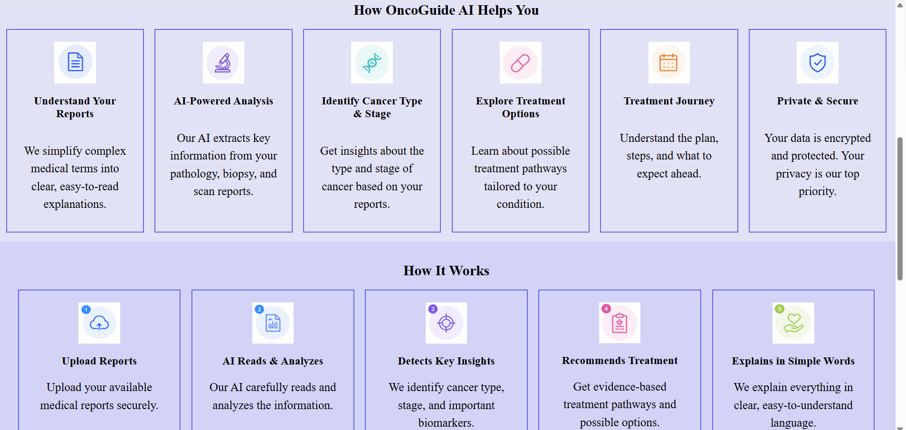
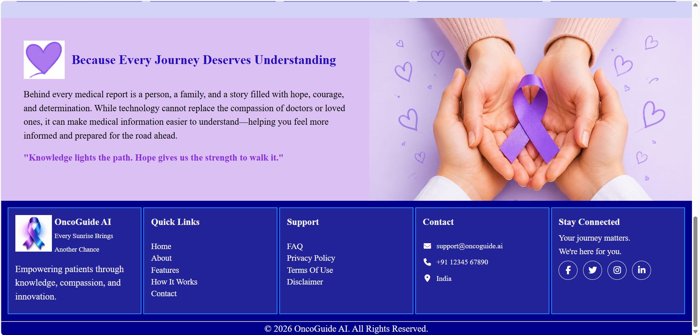
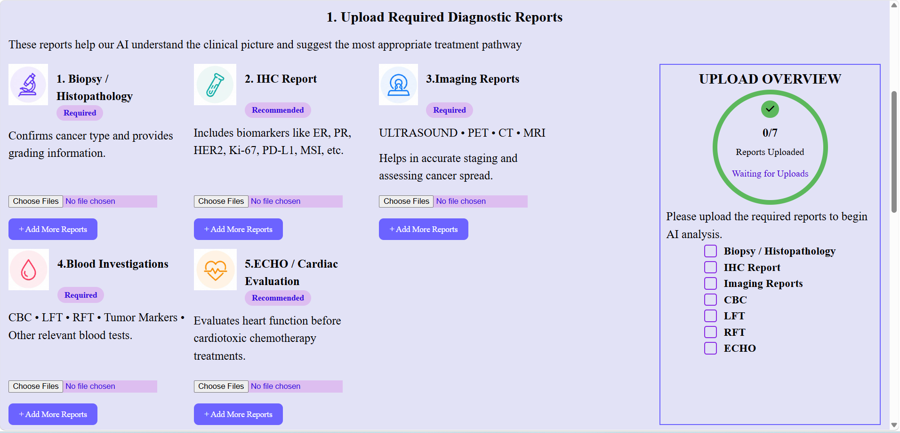
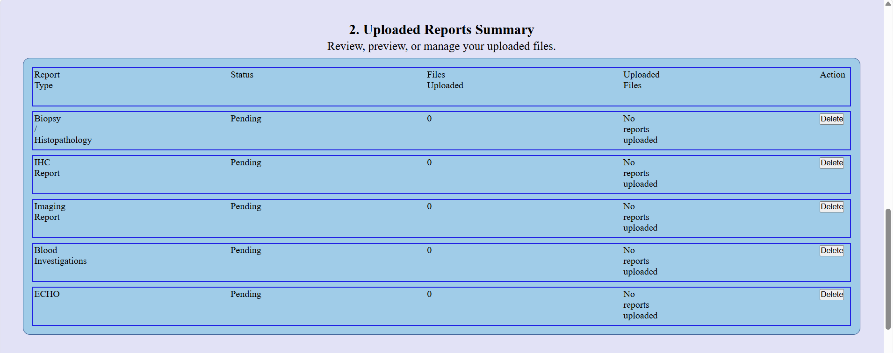
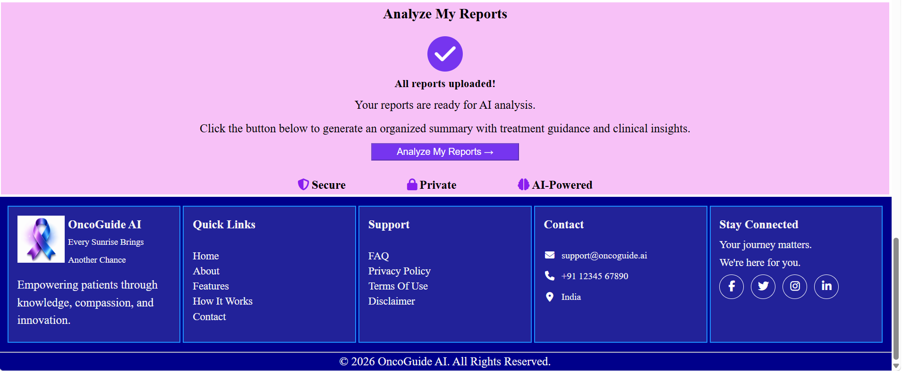
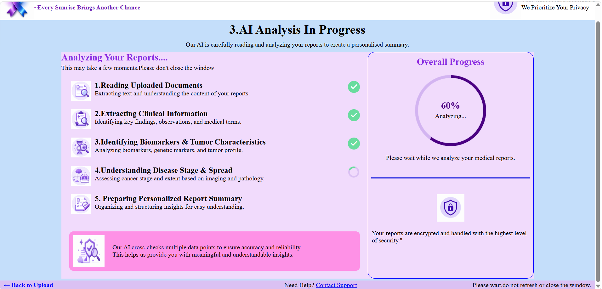
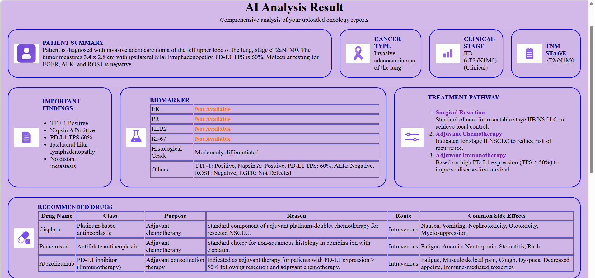
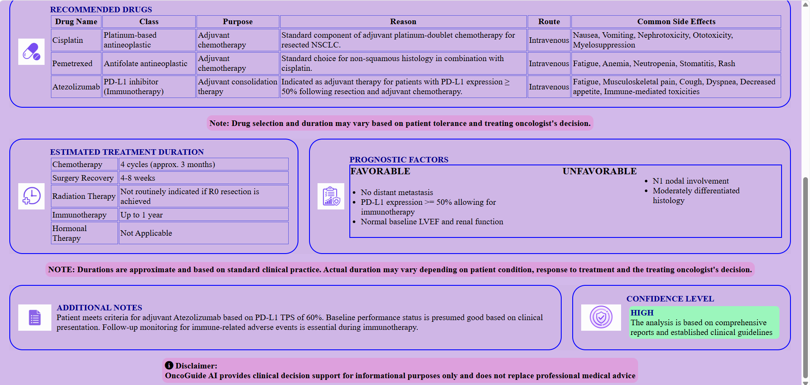

# 🩺 OncoGuide AI
> AI-powered Clinical Decision Support System for Oncology Report Analysis

## 📌 Overview

OncoGuide AI is a web-based clinical decision support system designed to assist healthcare professionals in analyzing oncology reports. It uses Google's Gemini AI model to extract important clinical information from uploaded medical reports and presents the results in a structured, easy-to-understand format.

The system helps organize patient information, identify key cancer characteristics, summarize important findings, and generate evidence-based treatment recommendations to support clinical decision-making.

> **Note:** OncoGuide AI is developed for educational purposes and should support, not replace, professional medical judgment.
---

# ✨ Features

-  Upload multiple oncology reports in PDF format.
-  AI-powered report analysis using Google Gemini API.
-  Automatically extracts:
  - Patient Summary
  - Cancer Type
  - Clinical Stage
  - TNM Stage
  - Tumor Size
  - Important Findings
  - Biomarkers (ER, PR, HER2, Ki-67, Histological Grade)
-  Generates evidence-based treatment pathways.
-  Recommends standard oncology drug regimens.
-  Estimates treatment duration.
-  Identifies prognostic factors.
-  Displays AI confidence level.
-  Modern and user-friendly interface.
---

# 🛠️ Tech Stack

### Frontend
- HTML5
- CSS3
- JavaScript

### Backend
- Node.js
- Express.js
- Multer
- pdf-parse

### AI
- Google Gemini API

### Development Tools
- Visual Studio Code
- Git
- GitHub
---

# 🚀 Project Workflow

1. **Upload Reports**
   - Doctors upload one or more oncology reports in PDF format.

2. **PDF Processing**
   - The backend extracts text from the uploaded reports using the `pdf-parse` library.

3. **AI Analysis**
   - The extracted report text is sent to the Google Gemini API for clinical analysis.

4. **Structured Data Extraction**
   - The AI identifies and organizes key clinical information, including:
     - Patient Summary
     - Cancer Type
     - Clinical Stage
     - TNM Stage
     - Tumor Size
     - Biomarkers
     - Important Findings

5. **Treatment Recommendations**
   - Based on the extracted diagnosis and standard oncology guidelines, the AI generates:
     - Treatment Pathway
     - Recommended Drug Regimens
     - Estimated Treatment Duration
     - Prognostic Factors

6. **Results Dashboard**
   - The analyzed information is displayed in a structured and easy-to-read interface for clinical review.

# 📸 Screenshots

## 🏠 Home Page

  

  

  

---

## 📤 Upload Reports

  

  

  

---

## 🤖 AI Analysis

  

---

## 📊 Results Dashboard

  

  

---

# 👩‍💻 Author

**Geetanshi Arora**

B.Tech Computer Science & Engineering (Artificial Intelligence)  
Indira Gandhi Delhi Technical University for Women (IGDTUW)

GitHub: **https://github.com/Geetanshi-Arora**

If you found this project helpful, consider ⭐ starring the repository.

